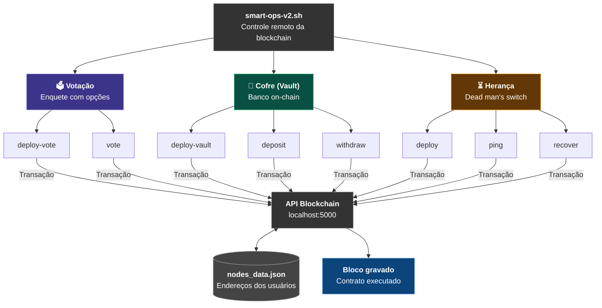

# 🪨 mini-blockchain v2

Simulador de blockchain educacional com suporte a smart contracts, API REST e testes de performance.



## 📁 Estrutura do Projeto

- `src/`: Core da aplicação (API, Lógica da Blockchain, Simuladores).
- `infra/`: Infraestrutura, Dockerfile e scripts operacionais.
- `.github/workflows/`: Automação de build e testes de performance.

## 🚀 Como Executar

### Localmente (Bash)
```bash
./infra/scripts/run.sh
```

### Via Docker
```bash
docker build -t mini-blockchain -f infra/Dockerfile .
docker run -p 5000:5000 mini-blockchain
```

## 📊 Funcionalidades
- **Blockchain**: Mineração automática, transações assinadas e integridade via hashes.
- **Smart Contracts**: Deploy e interação com contratos de votação, banco (vault) e herança.
- **API**: Endpoints para consulta de blocos, saldos e envio de transações.
- **Stress Test**: Motor de simulação de tráfego intenso e aleatório.

## 🛠️ Tecnologias
- Python 3.11+
- Flask & Flask-RESTX
- ECDSA (Criptografia)
- Docker & GitHub Actions
