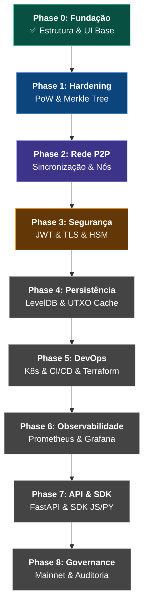

# 🪨 Blockchain Production Roadmap

> Base: mini-blockchain educacional (Python/Flask/ECDSA)  
> Objetivo: sistema distribuído, seguro e escalável em produção

---

## Phase 0 — Fundação (atual)
**Status:** ✅ Completo

- [x] Estrutura de blocos e hashes
- [x] Transações com ECDSA
- [x] API REST com Flask
- [x] Mineração simulada
- [x] UI básica

---

## Phase 1 — Hardening do Core
**Objetivo:** tornar a lógica de blockchain confiável e testável

- [ ] Proof of Work real com dificuldade ajustável (leading zeros)
- [ ] Ajuste dinâmico de dificuldade por tempo médio de bloco
- [ ] Validação completa da cadeia (hash, índice, timestamp, assinatura)
- [ ] Merkle Tree para hash das transações por bloco
- [ ] Proteção contra double-spend
- [ ] Mempool com priorização por fee
- [ ] Cobertura de testes unitários > 80% (`pytest`)

---

## Phase 2 — Rede P2P
**Objetivo:** múltiplos nós se descobrindo e sincronizando

- [ ] Protocolo P2P (WebSocket ou gRPC entre nós)
- [ ] Descoberta de peers (bootstrap nodes ou DHT simplificado)
- [ ] Propagação de blocos e transações pela rede
- [ ] Sincronização de cadeia ao entrar na rede (longest chain rule)
- [ ] Resolução de forks (consenso por cadeia mais longa)
- [ ] Tolerância a nós offline e reconexão automática

---

## Phase 3 — Segurança
**Objetivo:** resistir a ataques reais

- [ ] Remover Flask dev mode — WSGI em produção (Gunicorn + Nginx)
- [ ] Autenticação nas rotas de API (JWT ou API Key)
- [ ] Rate limiting por IP
- [ ] Validação rigorosa de inputs (schema validation)
- [ ] Gestão segura de chaves privadas (HSM ou vault — ex: HashiCorp Vault)
- [ ] TLS em todas as comunicações (nó-nó e nó-cliente)
- [ ] Proteção contra Sybil attack (registro de nós com proof of identity)
- [ ] Proteção contra 51% attack (monitoramento de hash rate por nó)

---

## Phase 4 — Persistência e Escalabilidade
**Objetivo:** dados confiáveis, performáticos e replicados

- [ ] Substituir `blockchain_data.json` por banco embarcado (LevelDB ou RocksDB)
- [ ] Indexação de transações por endereço e por bloco
- [ ] Cache de UTXO set em memória
- [ ] Snapshot e pruning de cadeia antiga
- [ ] Read replicas para queries de histórico sem impacto no nó ativo

---

## Phase 5 — Infraestrutura e DevOps
**Objetivo:** deploy reproduzível, monitorado e escalável

- [ ] Dockerizar cada nó (Dockerfile production-ready)
- [ ] `docker-compose` para rede local multi-nó de desenvolvimento
- [ ] Helm chart para deploy em Kubernetes
- [ ] CI/CD pipeline (GitHub Actions):
  - lint → testes → build → push imagem → deploy staging
- [ ] Variáveis de ambiente via secrets (não hardcoded)
- [ ] Health checks e readiness probes
- [ ] Terraform para provisionamento de infra (AWS/GCP/Azure)

---

## Phase 6 — Observabilidade
**Objetivo:** visibilidade total do que acontece na rede

- [ ] Métricas de nó expostas (Prometheus): hash rate, tx/s, peers conectados, tamanho da cadeia
- [ ] Dashboards (Grafana): estado da rede em tempo real
- [ ] Logs estruturados (JSON) com níveis (info, warn, error)
- [ ] Tracing distribuído (OpenTelemetry)
- [ ] Alertas para: nó offline, fork detectado, queda de peers, tx acumuladas na mempool

---

## Phase 7 — API e SDK
**Objetivo:** consumível por aplicações externas

- [ ] API REST versionada (`/v1/`) com OpenAPI spec completa
- [ ] Autenticação OAuth2 para clientes externos
- [ ] SDK Python e JavaScript para interagir com a rede
- [ ] Documentação completa (ReadTheDocs ou Docusaurus)
- [ ] Ambiente sandbox para desenvolvedores testarem sem afetar mainnet

---

## Phase 8 — Governance e Produção
**Objetivo:** operar com confiança

- [ ] Processo de upgrade de protocolo (soft fork / hard fork documentado)
- [ ] Nós validadores com identidade conhecida (permissioned) ou abertos (permissionless)
- [ ] Política de backup e disaster recovery
- [ ] Runbook operacional (como adicionar nó, como fazer rollback, como investigar fork)
- [ ] Auditoria de segurança externa do código

---

## Stack recomendada para produção

| Camada | Tecnologia |
|---|---|
| Runtime | Python 3.12+ ou rewrite em Go/Rust para performance |
| Web framework | FastAPI (substituir Flask) |
| P2P | libp2p ou implementação própria via WebSocket/gRPC |
| Storage | LevelDB / RocksDB |
| Infra | Docker + Kubernetes + Terraform |
| CI/CD | GitHub Actions |
| Observabilidade | Prometheus + Grafana + OpenTelemetry |
| Segurança | HashiCorp Vault + TLS mútuo |
| Criptografia | secp256k1 (mesmo do Bitcoin) via `coincurve` |

---

## Esforço estimado

| Phase | Complexidade | Tempo estimado (1 dev sênior) |
|---|---|---|
| 1 — Core | Média | 3–4 semanas |
| 2 — P2P | Alta | 6–8 semanas |
| 3 — Segurança | Alta | 4–6 semanas |
| 4 — Persistência | Média | 2–3 semanas |
| 5 — DevOps | Média | 2–3 semanas |
| 6 — Observabilidade | Baixa | 1–2 semanas |
| 7 — API/SDK | Média | 3–4 semanas |
| 8 — Governance | Alta | ongoing |

**Total estimado: 6–8 meses** para produção mínima viável (phases 1–6)

---

## 🗺️ Visual Roadmap

---

> 🪨 Comece pela Phase 1. Sem core sólido, nada acima funciona direito.