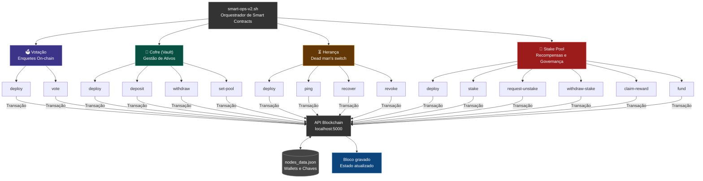

# 📜 Smart Contracts

## 🧠 Entendendo os Smart Contracts

Pense em um **Smart Contract** como uma "máquina de vendas" digital: você insere os dados (ou valores), a máquina processa as regras sozinha e entrega o resultado, sem precisar de um humano no meio para validar.

Neste projeto, simulamos quatro tipos comuns:
1.  **Votação**: Uma urna eletrônica onde cada voto é registrado e ninguém pode apagar.
2.  **Cofre (Vault)**: Um banco pessoal onde você guarda seus valores e só você (o dono) pode sacar.
3.  **Herança (Dead Man Switch)**: Um contrato que envia seus bens para outra pessoa se você ficar muito tempo sem dar um "ping" (avisar que está vivo).
4.  **Stake Pool**: Um sistema de recompensas onde você trava seus valores para ajudar na rede e ganha juros por isso.

### Fluxo de Operação
O diagrama abaixo mostra como os scripts interagem com esses contratos através da nossa API:

